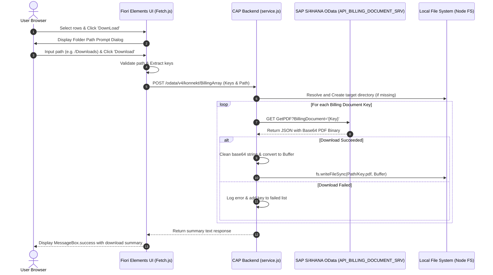

# CAP Multiple Invoice Downloader - Project Code & Structure Explanation

This document provides a comprehensive walkthrough of the project structure and the codebase for the **MultipleInvoice** SAP CAP application. This project enables users to select multiple billing documents (invoices) from an SAP Fiori Elements List Report, input a local file path, and download the respective invoice PDFs locally.

---

## 📂 Project Directory Structure

Below is the directory tree of the workspace, showing the layout of the Cloud Application Programming (CAP) backend and the SAPUI5/Fiori Elements frontend:

```text
MultipleInvoice/
├── .env                              # Stores credentials and external service URLs (local dev only)
├── .gitignore                        # Standard git exclusions
├── package.json                      # Project metadata, dependencies, scripts, and CDS configuration
├── package-lock.json                 # Lockfile for node package dependencies
├── readme.md                         # Default CAP getting started instructions
├── walkthrough.md                    # Overview of changes and implementation verification
│
├── srv/                              # Backend Service layer (CDS and Javascript handlers)
│   ├── service.cds                   # Definition of CDS service 'konnekt' and actions
│   ├── service.js                    # Javascript implementation of the OData hooks and custom action
│   ├── BillingDocument-annotations.cds# UI/OData annotations for columns, lists, and value-helps
│   └── external/                     # Imported metadata from external SAP systems
│       ├── API_BILLING_DOCUMENT_SRV.csn   # Compiled service representation (CSN) for S/4 OData service
│       └── API_BILLING_DOCUMENT_SRV.edmx  # Service metadata schema definition (EDMX XML)
│
└── app/                              # Frontend Applications layer
    ├── services.cds                  # Links frontend annotations to the service model
    └── billingdocument/              # Fiori Elements App for Billing Documents
        ├── .appGenInfo.json          # Fiori developer tools metadata
        ├── package.json              # App-specific dependencies and build configs
        ├── ui5.yaml                  # Local UI5 tooling server configuration
        └── webapp/                   # Main application web assets
            ├── Component.js          # Standard SAPUI5 Component entry point
            ├── index.html            # Standard HTML5 bootstrap wrapper for the UI5 application
            ├── manifest.json         # Application descriptor defining dataSources, routing, and custom action extensions
            ├── i18n/                 # Localization files
            │   └── i18n.properties   # Key-value translation resource bundle
            ├── test/                 # Test suites for UI verification
            └── ext/                  # Custom application extensions
                └── controller/       # Extension controllers
                    └── Fetch.js      # Controller logic for selecting invoices, prompting folder paths, and invoking CAP actions
```

---

## ⚙️ Configuration Files

### 1. [package.json](file:///Users/kvs/Desktop/SAP/YASH/MulitipleInvoice/package.json)
This is the root configuration file for the Node.js project. It lists dependencies, run scripts, and describes the configurations for SAP CAP (CDS).

```json
{
  "name": "MultipleInvoice",
  "version": "1.0.0",
  "description": "A simple CAP project.",
  "repository": "<Add your repository here>",
  "license": "UNLICENSED",
  "private": true,
  "dependencies": {
    "@cap-js/sqlite": "^2.4.0",
    "@sap-cloud-sdk/connectivity": "^4",
    "@sap-cloud-sdk/http-client": "^4.2.0",
    "@sap-cloud-sdk/resilience": "^4.2.0",
    "@sap/cds": "^9.9.1",
    "@sap/cds-dk": "^9.9.2",
    "express": "^4.22.2",
    "pdf-lib": "^1.17.1"
  },
  "devDependencies": {
    "@cap-js/cds-types": "^0.15.0"
  },
  "scripts": {
    "start": "cds-serve",
    "watch-billingdocument": "cds watch --open billingdocument/index.html?sap-ui-xx-viewCache=false --livereload false"
  },
  "cds": {
    "requires": {
      "auth": {
        "[production]": "xsuaa",
        "[sandbox]": "dummy"
      },
      "API_BILLING_DOCUMENT_SRV": {
        "kind": "odata-v2",
        "model": "srv/external/API_BILLING_DOCUMENT_SRV",
        "[production]": {
          "credentials": {
            "destination": "S4HANA_DEV",
            "path": "/sap/opu/odata/sap/API_BILLING_DOCUMENT_SRV",
            "requestTimeout": 300000
          }
        }
      }
    }
  },
  "sapux": [
    "app/billingdocument"
  ]
}
```

#### Key Highlights:
- **Dependencies**: Uses `@sap/cds` for core CAP service generation and the `@sap-cloud-sdk` package family to communicate with remote services. `pdf-lib` is present in package.json but is currently unused since PDFs are downloaded directly rather than merged.
- **Run Scripts**:
  - `npm start`: Starts the backend CAP engine.
  - `npm run watch-billingdocument`: Launches the backend while automatically bootstrapping and launching the `billingdocument` UI5 application in a local browser.
- **CDS Configurations**: Establishes `API_BILLING_DOCUMENT_SRV` as an external OData v2 client bound to the S/4HANA destination model (`srv/external/API_BILLING_DOCUMENT_SRV`).

---

### 2. [.env](file:///Users/kvs/Desktop/SAP/YASH/MulitipleInvoice/.env)
Contains local environment variables supplying connection parameters and credentials for the S/4HANA OData service.

```env
cds.requires.API_BILLING_DOCUMENT_SRV.credentials.url="https://my428820-api.s4hana.cloud.sap/sap/opu/odata/sap/API_BILLING_DOCUMENT_SRV"
cds.requires.API_BILLING_DOCUMENT_SRV.credentials.authentication="BasicAuthentication"
cds.requires.API_BILLING_DOCUMENT_SRV.credentials.username="YASH_DEV"
cds.requires.API_BILLING_DOCUMENT_SRV.credentials.password="nQB8BZ=MA~/sVuQw#GzMRYTZx%npgX9ZEl\Y[]=s"
```

> [!WARNING]
> This file is excluded from Git repository tracking (`.gitignore`) to keep the SAP login credentials confidential.

---

## 🖥️ Backend Services (Service Layer)

The files in the `srv/` folder structure define the API metadata and process data incoming from the UI before calling the SAP S/4HANA system.

### 3. [srv/service.cds](file:///Users/kvs/Desktop/SAP/YASH/MulitipleInvoice/srv/service.cds)
This file defines the service interface exposed by the backend CAP server.

```cds
using { API_BILLING_DOCUMENT_SRV as S4_BD } from './external/API_BILLING_DOCUMENT_SRV';

service konnekt {
    entity BillingDocument as projection on S4_BD.A_BillingDocument{
        @title : 'Billing Document'
        key BillingDocument,
        @title : 'Billing Type'
        BillingDocumentType,
        @title : 'Billing Date'
        BillingDocumentDate,
        @title : 'Sold-to Party'
        SoldToParty,
        @title : 'Net Value'
        TotalNetAmount,
        @title : 'Billing Document Status'
        OverallBillingStatus
    }

    action BillingArray(BillingDocument : String, filePath : String) returns {BillingDocument: String};

    @readonly
    @cds.persistence.skip
    entity OverallBillingStatusVH {
        @Common.Text: name
        @Common.TextArrangement: #TextFirst
        key code : String(1);
        name : String;
    }
}
```

#### Key Highlights:
- **`BillingDocument` Entity**: Projections on the remote entity `A_BillingDocument` from `API_BILLING_DOCUMENT_SRV`. It exposes the essential columns (Document, Type, Date, Sold-to Party, Net Value, Status) with user-friendly titles.
- **`BillingArray` Custom Action**: The custom HTTP POST endpoint called by the frontend. It accepts:
  - `BillingDocument`: A comma-separated string containing selected Billing Document IDs (e.g. `"90000124,90000125"`).
  - `filePath`: The system folder path where the user wants to download the generated PDFs.
- **`OverallBillingStatusVH`**: A helper entity that acts as a Value Help (dropdown) list mapping status codes (A, B, C...) to readable titles (Completed, Incomplete...). It uses `@cds.persistence.skip` since it doesn't map to a database table but is generated dynamically in memory.

---

### 4. [srv/service.js](file:///Users/kvs/Desktop/SAP/YASH/MulitipleInvoice/srv/service.js)
This file provides the backend runtime logic for the services defined in `service.cds`.

```javascript
const cds = require("@sap/cds");


module.exports = cds.service.impl(async function () {
    const S4_BD = await cds.connect.to("API_BILLING_DOCUMENT_SRV");

    const { BillingDocument, OverallBillingStatusVH } = this.entities;

    this.on("READ", BillingDocument, async (req) => {
        return await S4_BD.run(req.query);
    });

    this.on("READ", OverallBillingStatusVH, async (req) => {
        const statuses = [
            { code: 'A', name: 'Completed' },
            { code: 'B', name: 'Incomplete' },
            { code: 'C', name: 'Canceled' },
            { code: 'D', name: 'Not Relevant' },
            { code: 'E', name: 'To Be Posted' }
        ];
        return statuses;
    });

    this.on('BillingArray', async req => {
        try {
            const sBillingDocuments = req.data.BillingDocument;
            const filePath = req.data.filePath;
            if (!sBillingDocuments) {
                throw new Error('Missing required BillingDocument list');
            }
            if (!filePath) {
                throw new Error('Local folder path (filePath) is required');
            }

            const aDocIds = sBillingDocuments.split(',').map(id => id.trim()).filter(Boolean);
            if (aDocIds.length === 0) {
                throw new Error('No valid BillingDocument IDs provided');
            }

            const billingDocService = await cds.connect.to('API_BILLING_DOCUMENT_SRV');
            const fs = require('fs');
            const path = require('path');
            const resolvedPath = path.resolve(filePath.trim());
            fs.mkdirSync(resolvedPath, { recursive: true });

            const successDocs = [];
            const failedDocs = [];

            for (const BillDocId of aDocIds) {
                try {
                    const printPdf = await billingDocService.tx().send({
                        method: 'GET',
                        path: `GetPDF?BillingDocument='${BillDocId}'`
                    });

                    if (printPdf?.GetPDF?.BillingDocumentBinary) {
                        const cleanPdfBinary = printPdf.GetPDF.BillingDocumentBinary.replace(/(\r\n|\n|\r)/gm, "");
                        const fileBytes = Buffer.from(cleanPdfBinary, 'base64');
                        const fileDest = path.join(resolvedPath, `${BillDocId}.pdf`);
                        fs.writeFileSync(fileDest, fileBytes);
                        
                        console.log(`Successfully saved PDF locally at: ${fileDest}`);
                        successDocs.push(BillDocId);
                    } else {
                        console.warn(`Failed to retrieve PDF document for ID: ${BillDocId}`);
                        failedDocs.push(`${BillDocId} (Empty Binary)`);
                    }
                } catch (err) {
                    console.error(`Error fetching/saving PDF for ID ${BillDocId}:`, err);
                    failedDocs.push(`${BillDocId} (${err.message || 'Request failed'})`);
                }
            }

            // Construct response summary message
            let responseMsg = "";
            if (successDocs.length > 0) {
                responseMsg += `Successfully saved to ${filePath}:\n` + successDocs.map(id => `- ${id}.pdf`).join('\n') + `\n\n`;
            } else {
                responseMsg += `No documents were successfully saved.\n\n`;
            }

            if (failedDocs.length > 0) {
                responseMsg += `Not saved / Failed:\n` + failedDocs.map(entry => `- ${entry}`).join('\n');
            }

            return { BillingDocument: responseMsg };
        } catch (error) {
            console.error('Error in BillingArray handler:', error);
            throw new cds.error({
                code: 'BILLING_ARRAY_ERROR',
                message: error.message || 'Failed to process and save PDF documents',
                status: 500
            });
        }
    });
});
```

#### Key Highlights:
- **`READ BillingDocument`**: Automatically forwards read queries to the external `API_BILLING_DOCUMENT_SRV` connection (using `S4_BD.run(req.query)`).
- **`READ OverallBillingStatusVH`**: Directly returns a hardcoded array of key/value pairs to supply options to the status filter search dropdown.
- **`BillingArray` Handler**:
  - Accepts the comma-separated string `sBillingDocuments` and the target local path `filePath`.
  - Resolves and verifies the target file path. If the folder path doesn't exist, it uses `fs.mkdirSync(..., { recursive: true })` to create it dynamically.
  - Iterates over each Billing Document ID (`BillDocId`), sending a `GET` request to the remote S/4HANA OData action `GetPDF?BillingDocument='...'`.
  - If successful, it receives a Base64-encoded PDF binary. It strips carriage returns and newlines (`replace(/(\r\n|\n|\r)/gm, "")`), converts it to a standard byte buffer, and saves it locally via Node's `fs.writeFileSync(...)` utility.
  - Features isolated try/catch blocks: If one PDF fails to download (due to network error, invalid ID, or missing S/4 backend PDF content), the program logs the error, adds the ID to `failedDocs`, and continues download processing for remaining documents without crashing.
  - Compiles and returns a summary list back to the browser.

---

### 5. [srv/BillingDocument-annotations.cds](file:///Users/kvs/Desktop/SAP/YASH/MulitipleInvoice/srv/BillingDocument-annotations.cds)
This file configures UI components for the Fiori Elements application using semantic OData annotations.

```cds
using { konnekt } from './service';

annotate konnekt.BillingDocument with @(
        Capabilities.DeleteRestrictions : {
            $Type : 'Capabilities.DeleteRestrictionsType',
            Deletable: false
        },
        Capabilities : {
            FilterRestrictions : {
                FilterExpressionRestrictions :
                [{
                    Property : 'BillingDocumentDate',
                    AllowedExpressions : 'SingleRange'
                }]
            }
        },
        UI.PresentationVariant :{
        SortOrder : [
        {
                Property : BillingDocument,
                Descending : true,
            },
        ],
        Visualizations : [ 
            '@UI.LineItem',
        ],
    },

        UI.LineItem: [
            {
                $Type : 'UI.DataField',
                Label : 'Billing Document',
                ![@HTML5.CssDefaults]: {width:'10rem'},
                Value : BillingDocument,
            },
            {
                $Type : 'UI.DataField',
                Label : 'Billing Type',
                ![@HTML5.CssDefaults]: {width:'8rem'},
                Value : BillingDocumentType,
            },
            {
                $Type : 'UI.DataField',
                Label : 'Sold-to Party',
                ![@HTML5.CssDefaults]: {width:'8rem'},
                Value : SoldToParty,
            },
            {
                $Type : 'UI.DataField',
                Label : 'Billing Document Status',
                ![@HTML5.CssDefaults]: {width:'11rem'},
                Value : OverallBillingStatus,
            },
            
            {
                $Type : 'UI.DataField',
                Label : 'Billing Date',
                ![@HTML5.CssDefaults]: {width:'10rem'},
                Value : BillingDocumentDate,
            },
             {
                $Type : 'UI.DataField',
                Label : 'Net Value',
                ![@HTML5.CssDefaults]: {width:'10rem'},
                Value : TotalNetAmount,
            },

    ],
    UI.SelectionFields: [ BillingDocument, BillingDocumentType, SoldToParty, OverallBillingStatus, BillingDocumentDate ]
);

annotate konnekt.BillingDocument with {
    OverallBillingStatus @(
        Common.Label: 'Billing Document Status',
        Common.ValueListWithFixedValues: true,
        Common.ValueList: {
            $Type: 'Common.ValueListType',
            CollectionPath: 'OverallBillingStatusVH',
            Parameters: [
                {
                    $Type: 'Common.ValueListParameterInOut',
                    LocalDataProperty: OverallBillingStatus,
                    ValueListProperty: 'code'
                },
                {
                    $Type: 'Common.ValueListParameterDisplayOnly',
                    ValueListProperty: 'name'
                }
            ]
        }
    );
};
```

#### Key Highlights:
- **`DeleteRestrictions`**: Disables the standard Delete action on the List Report UI table since we should not delete billing documents directly from this interface.
- **`UI.LineItem`**: Configures the columns displayed in the main table layout, including column widths and sorting defaults.
- **`UI.SelectionFields`**: Declares filter fields that appear above the table (Filter Bar).
- **`OverallBillingStatus` Value Help**: Links the column to `OverallBillingStatusVH`, setting it as a dropdown select input displaying the readable name of the status instead of raw codes.

---

## 🎨 Frontend Application (UI Layer)

The UI uses SAP Fiori Elements List Report template. Frontend behavior is enriched via custom action extensions.

### 6. [app/billingdocument/webapp/manifest.json](file:///Users/kvs/Desktop/SAP/YASH/MulitipleInvoice/app/billingdocument/webapp/manifest.json)
This JSON file defines the application routing, metadata sources, and layout setups.

```json
{
  "_version": "1.85.0",
  "sap.app": {
    "id": "billingdocument",
    "type": "application",
    "i18n": "i18n/i18n.properties",
    ...
    "dataSources": {
      "mainService": {
        "uri": "/odata/v4/konnekt/",
        "type": "OData",
        "settings": {
          "annotations": [],
          "odataVersion": "4.0"
        }
      }
    }
  },
  ...
  "sap.ui5": {
    "dependencies": {
      "minUI5Version": "1.148.1",
      "libs": {
        "sap.m": {},
        "sap.ui.core": {},
        "sap.fe.templates": {}
      }
    },
    "models": {
      "": {
        "dataSource": "mainService",
        "preload": true,
        "settings": {
          "operationMode": "Server",
          "autoExpandSelect": true,
          "earlyRequests": true
        }
      }
    },
    "routing": {
      "routes": [
        {
          "pattern": ":?query:",
          "name": "BillingDocumentList",
          "target": "BillingDocumentList"
        },
        ...
      ],
      "targets": {
        "BillingDocumentList": {
          "type": "Component",
          "id": "BillingDocumentList",
          "name": "sap.fe.templates.ListReport",
          "options": {
            "settings": {
              "initialLoad": true,
              "contextPath": "/BillingDocument",
              "variantManagement": "Page",
              "controlConfiguration": {
                "@com.sap.vocabularies.UI.v1.LineItem": {
                  "tableSettings": {
                    "type": "ResponsiveTable"
                  },
                  "actions": {
                    "Fetch": {
                      "press": "billingdocument.ext.controller.Fetch.PrintInvoice",
                      "visible": true,
                      "enabled": "billingdocument.ext.controller.Fetch.enabledForPrintEinvoice",
                      "requiresSelection": true,
                      "text": "DownLoad"
                    }
                  }
                }
              }
            }
          }
        },
        ...
      }
    }
  }
}
```

#### Key Highlights:
- **`dataSources`**: Binds the UI frontend to the CAP backend service exposed at `/odata/v4/konnekt/` (OData v4).
- **`controlConfiguration`**: Integrates a custom extension button named **DownLoad** into the List Report table toolbar:
  - `press`: Invokes the Javascript function `PrintInvoice` inside the extension file `Fetch.js`.
  - `enabled`: Invokes `enabledForPrintEinvoice` inside `Fetch.js` to determine dynamically whether the button should be active.
  - `requiresSelection`: Ensures the button becomes selectable only when rows are ticked.

---

### 7. [app/billingdocument/webapp/ext/controller/Fetch.js](file:///Users/kvs/Desktop/SAP/YASH/MulitipleInvoice/app/billingdocument/webapp/ext/controller/Fetch.js)
This file contains the UI controllers handling list clicks and showing dynamic popup inputs.

```javascript
sap.ui.define([
    "sap/m/MessageToast",
    "sap/m/MessageBox",
    "sap/m/Dialog",
    "sap/m/Text",
    "sap/m/Input",
    "sap/m/TextArea",
    "sap/m/Button",
    "sap/m/VBox",
    "sap/ui/core/BusyIndicator"
], function (MessageToast, MessageBox, Dialog, Text, Input, TextArea, Button, VBox, BusyIndicator) {
    'use strict';

    return {
        /**
         * Generated event handler.
         *
         * @param oContext the context of the page on which the event was fired. `undefined` for list report page.
         * @param aSelectedContexts the selected contexts of the table rows.
         */
        PrintInvoice: async function (oBindingContext, aSelectedContexts) {
            if (!aSelectedContexts || aSelectedContexts.length === 0) {
                return;
            }

            var aBillingDocuments = aSelectedContexts.map(function (oContext) {
                return oContext.getObject().BillingDocument;
            });
            var sBillingDocuments = aBillingDocuments.join(",");

            var that = this;
            var fnInvokeBillingAction = async function (sFilePath) {
                var mParameters = {
                    model: aSelectedContexts[0].getModel(),
                    parameterValues: [
                        { name: 'BillingDocument', value: sBillingDocuments },
                        { name: 'filePath', value: sFilePath }
                    ],
                    skipParameterDialog: true
                };

                BusyIndicator.show();
                try {
                    var result = await that.editFlow.invokeAction('BillingArray', mParameters);
                    var oData = result.getObject();
                    var sMessage = "";
                    if (oData) {
                        if (oData.value && oData.value.BillingDocument) {
                            sMessage = oData.value.BillingDocument;
                        } else if (oData.BillingDocument) {
                            sMessage = oData.BillingDocument;
                        } else if (oData.value) {
                            sMessage = oData.value;
                        }
                    }

                    BusyIndicator.hide();
                    MessageBox.success(sMessage || "Files successfully downloaded.");
                } catch (e) {
                    MessageBox.error("An error occurred while downloading PDFs: " + e.message);
                    BusyIndicator.hide();
                }
            };

            var oInput = new Input({
                width: "100%",
                placeholder: "e.g., /Users/username/Downloads"
            });

            var oDialog = new Dialog({
                title: "Download PDF Invoices",
                type: "Message",
                content: new VBox({
                    items: [
                        new Text({ text: "Enter the local system folder path where the PDF files will be stored:" }),
                        oInput
                    ]
                }),
                beginButton: new Button({
                    text: "Download",
                    type: "Emphasized",
                    press: async function () {
                        var sFilePath = oInput.getValue().trim();
                        if (!sFilePath) {
                            oInput.setValueState("Error");
                            oInput.setValueStateText("Folder path is required to save the documents.");
                            return;
                        }
                        oInput.setValueState("None");
                        oDialog.close();
                        await fnInvokeBillingAction(sFilePath);
                    }
                }),
                endButton: new Button({
                    text: "Cancel",
                    press: function () {
                        oDialog.close();
                    }
                }),
                afterClose: function () {
                    oDialog.destroy();
                }
            });

            oDialog.open();
        },

        enabledForPrintEinvoice: function (oBindingContext, aSelectedContexts) {
            if (aSelectedContexts && aSelectedContexts.length >= 1) {
                return true;
            }
            return false;
        },
    };
});
```

#### Key Highlights:
- **`enabledForPrintEinvoice`**: Enables the **DownLoad** button as long as at least one row in the table is checked.
- **`PrintInvoice`**:
  - Captures the selected table rows, extracts the `BillingDocument` key, and joins them into a comma-separated string list.
  - Builds and displays an SAPUI5 `sap.m.Dialog` containing a `sap.m.Input` field.
  - Validates that the input path is not empty.
  - Invokes `that.editFlow.invokeAction('BillingArray', ...)` (part of SAP Fiori Elements EditFlow APIs) to send a request to the backend CAP server containing the list of keys and target path.
  - Displays a global SAP loading overlay (`BusyIndicator.show()`) while processing, and displays a success notification (`MessageBox.success`) or error alert (`MessageBox.error`) when completed.

---

## 🔄 End-to-End Execution Flow Diagram

The diagram below details how the UI, CAP Backend, and SAP S/4HANA OData service interact during download processing:


